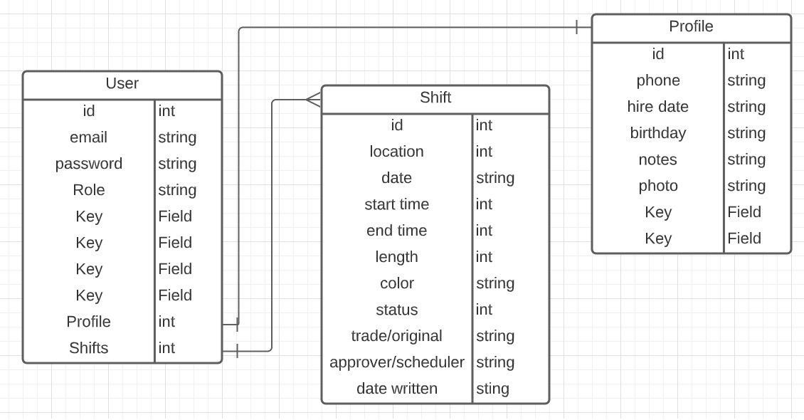

### OSLO SCHEDULING SOFTWARE

## Approach
-- Mobile-first
-- SPA?

## Features
-- Shift swap
-- Time clock

## User Stories
As an administrator, I want to:
-- View entire schedule
-- View schedule for specific employee
-- Add shifts to a shop
-- Edit shift times
-- Schedule an employee for a shift
-- Edit a schedule without publishing it
-- Schedule employees for shifts
-- Remove employees from shifts
-- Approve shift trades
-- Decline shift trades

As an employee, I want to:
-- View my schedule
-- View whole schedule
-- Offer my shift to whoever wants it
-- Offer my shift to a specific employee
-- Configure a shift swap
-- Offer a shift swap
-- Accept a shift swap
-- Decline a shift swap
-- Clock in
-- Clock out

## ERD

## Wireframe

## Technology
-- Django
-- PostgreSQL

